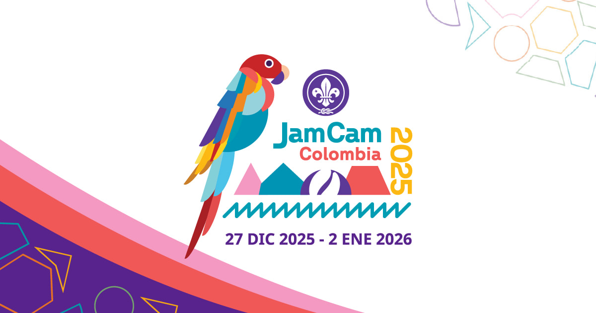

# JamCam 2025 Website

Official website for JamCam 2025 - Américas Unidas por la Paz, a transformative Scout event that will bring together thousands of young people from across the Americas to celebrate brotherhood, diversity, and adventure.



## About the Project

This website has been **migrated from HTML/CSS/JavaScript to Astro with Tailwind CSS** to provide better performance, maintainability, and developer experience while maintaining all the original functionality.

### Development Team

This website is the result of a collaborative volunteer effort between:
- **National Communications Commission** (Asociación Scouts de Colombia)
- **NoLit Developers**

All work on this project has been done on a voluntary basis, embodying the Scout spirit of service and commitment to the community.

## 🚀 Technology Stack

- **Framework**: [Astro 5.11+](https://astro.build/) with TypeScript
- **Styling**: [Tailwind CSS v4](https://tailwindcss.com/)
- **Deployment**: [Vercel](https://vercel.com/) with SSR adapter
- **Analytics**: Vercel Analytics & Speed Insights
- **Package Manager**: npm

## ✨ Features

- **🌍 Multi-language Support**: Spanish (default), English, Portuguese, French
- **📱 Fully Responsive Design**: Optimized for mobile, tablet, and desktop
- **⏰ Interactive Countdown Timer**: Real-time event countdown with animations
- **🎨 Modern UI Components**: Built with Astro components and Tailwind CSS
- **🔄 Dynamic Language Switching**: Seamless language transitions
- **🎭 Smooth Animations**: Intersection Observer API for scroll effects
- **📊 Analytics Integration**: Performance monitoring and user insights
- **♿ Accessibility Focused**: ARIA attributes and semantic HTML
- **🚀 SEO Optimized**: Meta tags, Open Graph, and sitemaps
- **📋 Interactive Forms**: Contact forms and newsletter subscription
- **🗓️ Event Calendar**: Program schedule and activities
- **📚 Resource Downloads**: Downloadable materials and documentation

## 🏗️ Architecture

### Project Structure
```
jamcam-astro/
├── src/
│   ├── components/          # Reusable Astro components
│   │   ├── Header.astro           # Navigation with mobile menu
│   │   ├── Footer.astro           # Site footer
│   │   ├── Banner.astro           # Hero sections
│   │   ├── Countdown.astro        # Event countdown timer
│   │   ├── Calendar.astro         # Event schedule
│   │   ├── Contact.astro          # Contact forms
│   │   └── ...                    # Other components
│   ├── pages/               # File-based routing
│   │   ├── index.astro            # Spanish homepage (default)
│   │   ├── about.astro            # About page
│   │   ├── program.astro          # Program information
│   │   ├── resources.astro        # Resources and downloads
│   │   ├── contacts.astro         # Contact information
│   │   ├── en/                    # English pages
│   │   ├── pt/                    # Portuguese pages
│   │   └── fr/                    # French pages
│   ├── i18n/                # Internationalization
│   │   ├── index.ts               # Translation utilities
│   │   ├── es.ts                  # Spanish translations
│   │   ├── en.ts                  # English translations
│   │   ├── pt.ts                  # Portuguese translations
│   │   └── fr.ts                  # French translations
│   ├── styles/              # Global styles
│   │   └── global.css             # Tailwind config + custom variables
│   ├── layouts/             # Page layouts
│   └── assets/              # Static assets
├── public/                  # Public assets
│   ├── fonts/                     # Custom fonts (Noto Sans)
│   ├── images/                    # Images and graphics
│   └── favicon/                   # Favicon files
├── astro.config.mjs         # Astro configuration
├── package.json            # Dependencies and scripts
├── tsconfig.json           # TypeScript configuration
└── tailwind.config.js      # Tailwind CSS configuration
```

### Key Components

- **Header.astro**: Responsive navigation with mobile hamburger menu
- **Countdown.astro**: Real-time countdown to event with decorative animations
- **Calendar.astro**: Interactive event schedule and program
- **LanguageSwitcher.astro**: Dynamic language selection with flag icons
- **Contact.astro**: Contact forms and information sections
- **Analytics.astro**: Vercel Analytics and Speed Insights integration

## 🎨 Design System

### Custom Color Palette
```css
:root {
  --color-purple-jm: #622599;
  --color-orange-jm: #e46e27;
  --color-salmon-jm: #F15857;
  --color-pink-jm: #F499C1;
  --color-yellow-jm: #FCB813;
  --color-green-jm: #0094B4;
  --color-red-jm: #c72528;
}
```

### Typography
- **Font Family**: Noto Sans (300, 400, 600, 700 weights)
- **Format**: WOFF2 for optimal performance
- **Loading Strategy**: `font-display: swap`

## 🌐 Internationalization

The website supports four languages with locale-based routing:

- **🇪🇸 Spanish (default)**: `/`, `/about`, `/program`
- **🇺🇸 English**: `/en/`, `/en/about`, `/en/program`
- **🇵🇹 Portuguese**: `/pt/`, `/pt/about`, `/pt/program`
- **🇫🇷 French**: `/fr/`, `/fr/about`, `/fr/program`

### Translation System
- Type-safe translations with TypeScript
- Centralized translation files in `src/i18n/`
- Automatic locale detection and routing
- Seamless language switching with preserved navigation state

## 🛠️ Development

### Prerequisites
- Node.js 18+
- npm 10+

### Setup
```bash
# Clone the repository
git clone https://github.com/MiloAgudelo/jamcam-astro.git
cd jamcam-astro

# Install dependencies
npm install

# Start development server
npm run dev
```

### Available Scripts
```bash
npm run dev        # Start development server (localhost:4321)
npm run build      # Build for production
npm run preview    # Preview production build locally
npm run astro      # Run Astro CLI commands
```

### Development Guidelines
1. Follow the component-based architecture using Astro components
2. Use TypeScript for type safety
3. Implement responsive design with mobile-first approach
4. Maintain i18n consistency across all languages
5. Use semantic HTML and proper accessibility attributes
6. Follow the established color palette and design system

## 🚀 Deployment

The project is configured for deployment on Vercel with:
- **Adapter**: `@astrojs/vercel` with server output
- **Domain**: jamcam2025.com
- **SSL**: Automatic HTTPS with Vercel
- **Analytics**: Vercel Analytics and Speed Insights integration

### Environment Configuration
- **Production**: Automatic deployment from main branch
- **Preview**: Automatic preview deployments for pull requests
- **Performance**: Server-side rendering (SSR) enabled

## 📱 Browser Support

Optimized for modern browsers:
- Chrome (latest)
- Firefox (latest)
- Safari (latest)
- Edge (latest)
- Mobile browsers (iOS Safari, Chrome for Android)

## 🤝 Contributing

1. Fork the repository
2. Create a feature branch (`git checkout -b feature/amazing-feature`)
3. Make your changes following the development guidelines
4. Test across different languages and devices
5. Commit your changes (`git commit -m 'Add amazing feature'`)
6. Push to your branch (`git push origin feature/amazing-feature`)
7. Open a Pull Request

### Code Standards
- Use TypeScript for type safety
- Follow Astro component patterns
- Maintain responsive design principles
- Ensure accessibility compliance
- Test i18n functionality across all languages

## 📄 License

This project is licensed under the MIT License - see the LICENSE file for details.

## 📞 Contact

**Asociación Scouts de Colombia**
- Website: [https://linktr.ee/JamCamOfficial](https://linktr.ee/JamCamOfficial)
- Instagram: [@jamcamofficial](https://www.instagram.com/jamcamofficial)
- Spotify: [JamCam Official](https://open.spotify.com/user/31eknrqjt2siqjcir5z62plntyqy)

---

*Built with ❤️ by volunteers for the Scout community*
